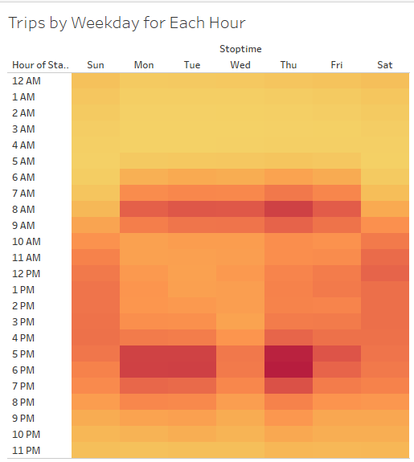
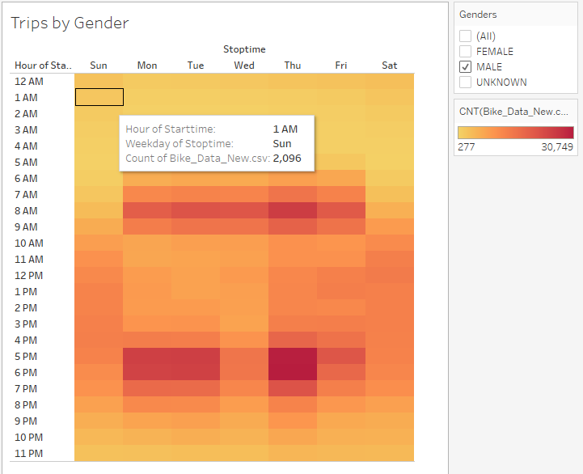
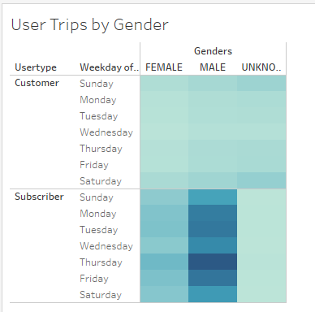

# bikesharing

# Overview of the statistical analysis
- For the analysis we created visualizations using Tableau to assist with convincing investors that a bike sharing program in a new city will be a great investment. In order to accomplish this we used data from NYC Citibike trip data from 2019. Using Tableau we created a few different visualizations that will help the investors better understand the data versus just looking at numbers on a excel spreadsheet. Our visualizations include checkout times by gender, trips by weekday, total trips by gender, checkout times for users, and user trips by gender showing customers and subscribers. 

# Results
- Trips by Weekday for each hour
- 

- Peak times for trips during the weekdays are from 5:00pm to 7:00pm and are at a all time high on Thursdays. Thursday's at 6:00pm have the total amount of trips with 44,905. 

- Trips by Gender
- 

- Males have make up a larger portion of riders with a total of 30,749. 

- User trips by Gender
- 

- As you can see above this visualization shows that a mojority of the riders are subscribers and also males. 

# Summary
- In summary, I believe that Tableau is a very powerful tool that allows for you to better represent data to your audience. As you can see in the visualizations above you can get a very accurate picture of the data to be understand and answer questions your audience may have.

[link to dashboard](https://public.tableau.com/app/profile/erik5653/viz/NYC_Citibike_Dashboard_16532516421440/Dashboard1)

[link to story](https://public.tableau.com/app/profile/erik5653/viz/NYC_Citibike_Story_16532518739240/NYCCitibikeStory)

